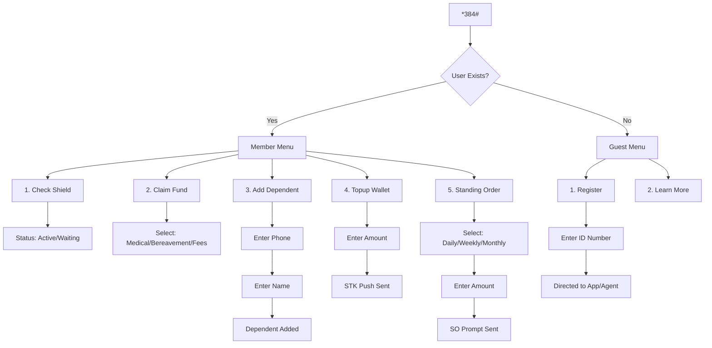

# Hazina Care USSD Workflow

This document outlines the USSD menu structure and confirms the active credentials for testing.

## 1. Visual Workflow

## 2. API Configuration Status

The following keys are **already configured** in the project's environment (`functions/.env`) and `index.js` hardcoded fallbacks:

| Service | Key | Status |
| :--- | :--- | :--- |
| **Africa's Talking** | `AT_USERNAME`, `AT_API_KEY` | ✅ Configured |
| **SasaPay** | `CLIENT_ID`, `CLIENT_SECRET`, `MERCHANT_CODE` | ✅ Configured (Sandbox) |
| **Google AI** | `GEMINI_API_KEY` | ✅ Configured |

## 3. How to Test
1. Open the [Africa's Talking Simulator](https://simulator.africastalking.com:9246/).
2. Enter your phone number (use `07...` or `+254...`).
3. Dial `*384#` to see the live menu response from your deployed Firebase Functions.
